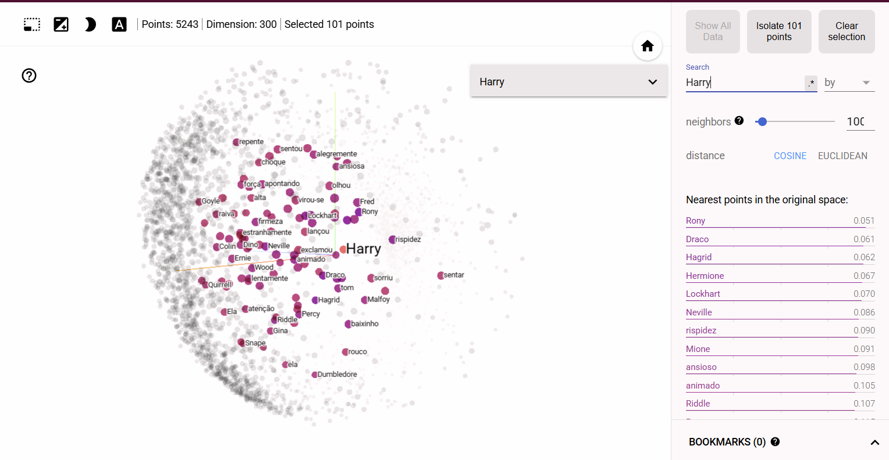

# TPC9

Este trabalho de casa consistiu na exploração de modelos *Word Embeddings*, com recurso à biblioteca **Gensim**. O objetivo principal foi treinar um modelo **Word2Vec** recorrendo aos dois primeiros livros da saga "Harry Potter" para analisar relações semânticas e analogias entre personagens e conceitos.

## Passo a passo de resolução

### Passo 1: Preparação do texto

O ficheiro de texto foi lido e, após a leitura, foi removida a parte inicial do documento que não fazia parte da narrativa principal.
O texto resultante foi depois processado pelo modelo de linguagem do spaCy para separação em frases e, posteriormente, em tokens.

### Passo 2: Treino do Modelo Word2Vec
Utilizou-se a biblioteca `Gensim` para treinar o modelo. Nos parâmetros do modelo foram testadas algumas combinações mas a versão final utilizou:
- vector_size=300
- window=5
- min_count=3
- sg=0
- epochs=10
- workers=3

### Passo 3: Testes do Modelo
Para análise dos resultados do modelo foram feitos diferentes testes como:
- *most similar* -> dá as 10 palavras mais próximas da palavra passada como argumento
- *similarity* -> dá o grau de similaridade entre 2 palavras passadas como argumento
- *odd one out* -> dá a palavra mais afastada das restantes de uma lista de palavras passada como argumento
- *analogies* -> permite criar analogias entre palavras utilizando parâmetros positivos e negativos

## Modelo no tensorflow

